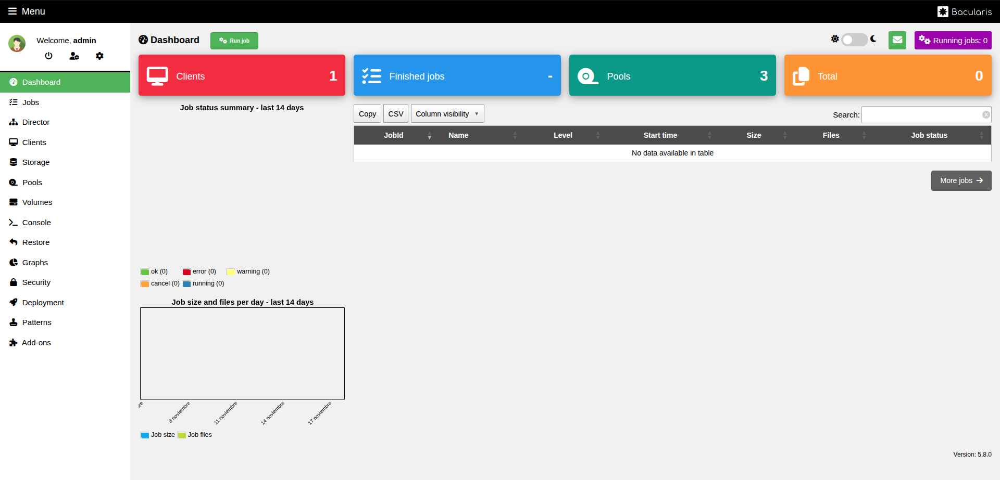

# bacularis-kubernetes
Instalacion de bacula con baculum en kubernetes

> [\!TIP]
> Si no tienes un clúster de Kubernetes, puedes seguir mi [guía de instalación](https://github.com/1237446/Instalacion-de-RK2-con-Cilium).

-----

## 1\. Despliegue de Postgresql

Utilizaremos el operador de CloudNativePG (CNPG) para gestionar nuestro clúster de base de datos de forma automatizada.

  * **Crea el namespace para Bacula:**
  
      ```bash
      kubectl create namespace bacula
      ```

  * **Instala el operador:**
  
      ```bash
      kubectl apply --server-side -f https://raw.githubusercontent.com/cloudnative-pg/cloudnative-pg/release-1.27/releases/cnpg-1.27.1.yaml
      ```

  * **Despliega el clúster de Postgresql:**
  
      ```bash
      kubectl apply -f postgresql/postgresql.yaml -f postgresql/postgresql-secrets.yaml
      ```
  
  * **Verifica que los Pods del clúster estén listos:**
  
      ```bash
      kubectl get pods -n bacula
      
      NAME                 READY   STATUS    RESTARTS   AGE
      postgresql-node-0    1/1     Running   0          4m
      postgresql-node-1    1/1     Running   0          4m
      postgresql-node-2    1/1     Running   0          4m
      ```

-----

## 2\. Despliegue de Bacula

Ahora, despliega los componentes principales de Bacula (Director, Storage Daemon y File Daemon).

### Bacula-dir (Director Bacula)
  * **Aplica los manifiestos de bacula-dir:**
  
      ```bash
      kubectl apply -f bacula/bacula-dir.yaml
      ```

  * **Verifica que el pod de Bacula-dir estén en ejecución:**
  
      ```bash
      kubectl get pods -n bacula
      
      NAME                           READY   STATUS    RESTARTS   AGE
      bacula-dir-bdc694575-8g5tq     1/1     Running   0          30s

  * **Ingresa al Pod de Bacula-dir:**
  
      ```bash
      kubectl exec -it -n bacula bacula-dir-bdc694575-8g5tq -- bash
      ```
  
  * **Instala un editor de texto (ej. nano) y edita el archivo de configuración:**
  
      ```bash
      # Dentro del pod
      apk add nano
      nano /etc/bacula/bacula-dir.conf
      ```

  * **Añade las siguientes líneas** dentro del array de **Catalog**. Asegúrate de reemplazar las credenciales con las de tu base de datos.
          
      ```bash
      ...
      # Generic catalog service
      Catalog {
        Name = MyCatalog
        dbdriver = "postgresql"
        dbaddress = "postgresql-node-rw"          
        dbport = 5432
        dbuser = "bacula"
        dbpassword = "bacula"
        dbname = "bacula"
      }
      
      # Reasonable message delivery -- send most everything to email address
      #  and to the console
      Messages {
        Name = Standard
      #
      ...
      ```     
      Guarda el archivo (`Ctrl+O`) y sal (`Ctrl+X`).
    
  * **Salimos del pod y ejecutamos el job de correccion:**
    
      ```bash
      kubectl exec -it -n bacula bacula-dir-bdc694575-8g5tq -- bash
      ```

  * **Verifica que se haya completado:**
    
      ```bash      
      NAME                               READY   STATUS      RESTARTS   AGE
      bacula-catalog-initializer-279st   0/1     Completed   1          21s
      ```
       
  * **Eliminamos el pod de Bacula-dir para reiniciar el servicio**
  
      ```bash
      kubectl delete pods -n bacula bacula-dir-bdc694575-8g5tq
      ```
     
  * **Verifica que el pod de Bacula-dir estén en ejecución:**
  
      ```bash
      kubectl get pods -n bacula
      
      NAME                           READY   STATUS    RESTARTS   AGE
      bacula-dir-bdc694575-v9b78     1/1     Running   0          15s

### Bacula-SD (Storage Daemon Bacula)

  * **Ingresa al Pod de Bacula-dir:**
  
      ```bash
      kubectl exec -it -n bacula bacula-dir-bdc694575-v9b78 -- bash
      ```
  
  * **Visualizamos el archivo de configuración, copiamos el nombre del director y contraseña:**
  
      ```bash
      # Dentro del pod
      cat /etc/bacula/bacula-dir.conf
      ```

      ```bash
      ...
      Director {
        Name = build-3-22-x86_64-dir <--- CONTRASEÑA DE BACULA-DIR
        DIRport = 9101
        QueryFile = "/etc/bacula/scripts/query.sql"
        WorkingDirectory = "/var/lib/bacula"
        PidDirectory = "/run/bacula"
        Maximum Concurrent Jobs = 20
        Password = "UUE0c1INvpM51w2MBJZE/n1GLjAiFfZPwNE0N22508QZ" <--- CONTRASEÑA DE BACULA-DIR
        Messages = Daemon
      }
      ...
      ```
      
  * **Salimos del pod y editamos el configmap:**
    
      ```bash
      #---------------------------------------------------------------------
      # Archivo de configuracion bacula-sd
      #---------------------------------------------------------------------
      apiVersion: v1
      kind: ConfigMap
      metadata:
        name: bacula-sd
        namespace: bacula
      data:
        bacula-sd.conf: |-
      ...
      #---------------------------------------------------------------------
      # Autorización de Directores
      #---------------------------------------------------------------------
      Director {
        Name = build-3-22-x86_64-dir <--- CONTRASEÑA DE BACULA-DIR
        Password = "UUE0c1INvpM51w2MBJZE/n1GLjAiFfZPwNE0N22508QZ" <--- CONTRASEÑA DE BACULA-DIR
      }
      ...
      ```
      
  * **Aplica los manifiestos de bacula-sd:**
  
      ```bash
      kubectl apply -f bacula/bacula-sd.yaml
      ```

  * **Verifica que el pod de Bacula-sd estén en ejecución:**
  
      ```bash
      kubectl get pods -n bacula
      
      NAME                           READY   STATUS    RESTARTS   AGE
      bacula-sd-5bc6669584-c5f92     1/1     Running   0          30s
      ```    
-----

## 3\. Despliegue de Bacularis (GUI)

Finalmente, despliega la interfaz web de Baculum, que consiste en una API y el frontend web.

  * **Aplica los manifiestos de Bacularis:**
  
      ```bash
      kubectl apply -f bacularis/bacularis-web.yaml
      ```
  
  * **Verifica que los pods de Bacularis estén listos:**
  
      ```bash
      kubectl get pods -n bacula
      
      NAME                             READY   STATUS    RESTARTS   AGE
      bacularis-web-744786cf5-dkbh7    1/1     Running   0          5m
      ```
      
### Acceso en el navegador web

  * **Verifica que los services de Bacularis:**
    
      ```bash
      kubectl get svc -n bacula
      
      NAME                 TYPE           CLUSTER-IP      EXTERNAL-IP    PORT(S)                         AGE
      bacula-dir           LoadBalancer   10.43.124.46    172.16.9.106   9097:31019/TCP,9101:31933/TCP   3h11m
      bacula-sd            LoadBalancer   10.43.98.2      172.16.9.109   9103:31393/TCP                  26m
      bacularis-web        LoadBalancer   10.43.196.167   172.16.9.108   9097:32430/TCP                  26m
      ```

La interfaz web de Bacularis está disponible en http://172.16.9.108:9097, **admin** con usuario y contraseña predeterminados **admin**.

   

-----

## 4\. Guía de Instalación del Agente Bacula (Windows File Daemon)

Esta guía detalla el proceso para descargar, instalar y configurar el agente de cliente de Bacula en un entorno Windows.

   ### Descarga del Software
   
   * **Acceda al sitio web oficial:** Diríjase al [Centro de Descargas de Bacula](https://www.bacula.org/binary-download-center/).
     
   *  **Seleccione el instalador:** Localice y descargue los binarios para Windows correspondientes a la versión **15.0.3** (asegúrese de elegir la arquitectura correcta, usualmente 64-bits).
   
   
   
   ### Proceso de Instalación
   
   *  **Ejecutar el instalador:** Abra el archivo descargado en el equipo cliente Windows.

   
     
   *  **Acuerdo de Licencia:** Lea y acepte los términos de la licencia para continuar.

   
     
   *  **Tipo de Instalación:** Cuando se le solicite, seleccione el tipo de instalación **Custom** (Personalizada).

   
     
   *  **Selección de Componentes:**
     
       * Despliegue la lista de componentes.
       
       
       
       * Asegúrese de marcar **Client -> File Service**.
    
   > [\!NOTE]
   >  Esto instalará únicamente el servicio necesario para que el servidor Bacula pueda realizar copias de seguridad de este equipo.
         
   *  **Directorio de Instalación:** Seleccione la ruta donde se alojarán los archivos de Bacula o mantenga la ruta por defecto.

       
    
   *  **Configuración del Cliente (File Daemon):**

       * **Nombre del Agente:** Ingrese un nombre único para identificar a este cliente en la red.
       * **Contraseña:** Defina una contraseña segura.

       

   > [!WARNING]
   > Guarde el **Nombre del Agente** y la **Contraseña** en un lugar seguro. Estos datos son obligatorios para configurar posteriormente el archivo `bacula-dir.conf` en el servidor Director.
     
   *  **Configuración del Director y Monitor:**
     
       * **Nombre del Director:** Ingrese el nombre exacto del Director de Bacula que gestionará este cliente.
     
       * **Monitor:** Si va a utilizar un monitor de estado, defina su nombre y contraseña.
    
       
      
   > [\!NOTE]
   >  Al igual que en el paso anterior, registre estas credenciales, ya que deben coincidir exactamente con la configuración del servidor.
       
   *  **Finalización:** Haga clic en **Instalar**, espere a que la barra de progreso se complete y seleccione **Finalizar**.

       

       
   
   ### Configuración del Firewall de Windows (Entrada y Salida)

   Para garantizar la comunicación bidireccional correcta con el servidor, configuraremos reglas tanto para el tráfico entrante como saliente.

   > [\!TIP]
   > Otra alternativa para activar el firewall es usando el script 
   
   *  **Abrir configuración:** Busque y abra "Windows Defender Firewall con seguridad avanzada".
     
   *  **Crear Regla de Entrada:**
     
       * En el panel izquierdo, seleccione **Reglas de entrada** (*Inbound Rules*).
     
       * En el panel derecho, haga clic en **Nueva regla...**
        
   *  **Tipo de Regla:** Seleccione la opción **Puerto**.

       
     
   *  **Protocolo y Puertos:**
     
       * Seleccione **TCP**.
        
       * En "Puertos locales específicos", ingrese el puerto estándar del agente: **9101-9103**.
    
         
        
   *  **Acción:** Seleccione **Permitir la conexión**.

         
     
   *  **Perfil:** Marque todas las casillas que apliquen a su entorno (Dominio, Privado y Público) para asegurar la conectividad.

         
     
   *  **Nombre:** Asigne un nombre descriptivo a la regla, por ejemplo: `Bacula`.

         
     
   *  **Guardar:** Haga clic en Finalizar para activar la regla.

   ### Verificación del Servicio
   
   Antes de dar por finalizada la instalación en el cliente, debemos confirmar que el agente se está ejecutando correctamente.

   * Presione las teclas Windows + R, escriba services.msc y presione Enter.    
   * En la lista de servicios, busque el llamado Bacula File Daemon.  
   * Verifique la columna "Estado": debe decir En ejecución (Running).   
   * Verifique la columna "Tipo de inicio": debe estar en Automático.  
      * Si el servicio no está corriendo: Haga clic derecho sobre él y seleccione Iniciar.
     
